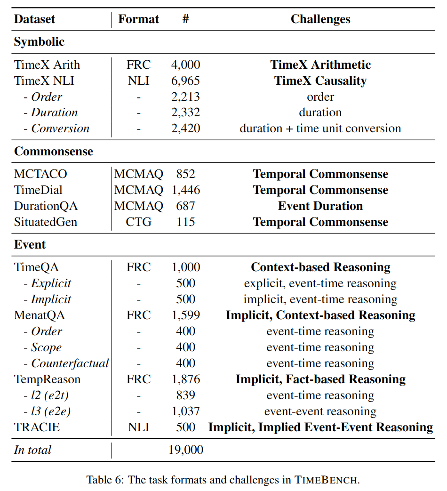
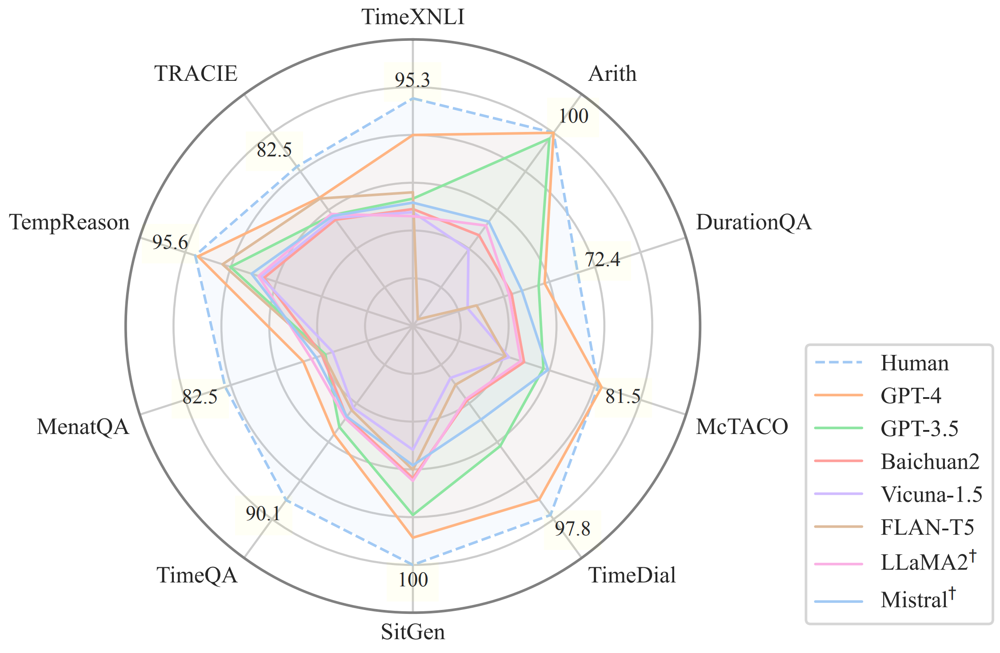

# TimeBench: A Comprehensive Evaluation of Temporal Reasoning Abilities in Large Language Models
This is the repository containing evaluation datas, instructions and demonstrations with paper _**TimeBench: A Comprehensive Evaluation of Temporal Reasoning Abilities in
  Large Language Models**_

## Datasets


## Models
- GPT-4
- GPT-3.5
- LLaMA2
- Baichuan2
- Vicuna-1.5
- Mistral
- ChatGLM3
- FLAN-T5

## Performance


## Citation
If you find our work helpful, you can cite this paper as:

```bibtex

```