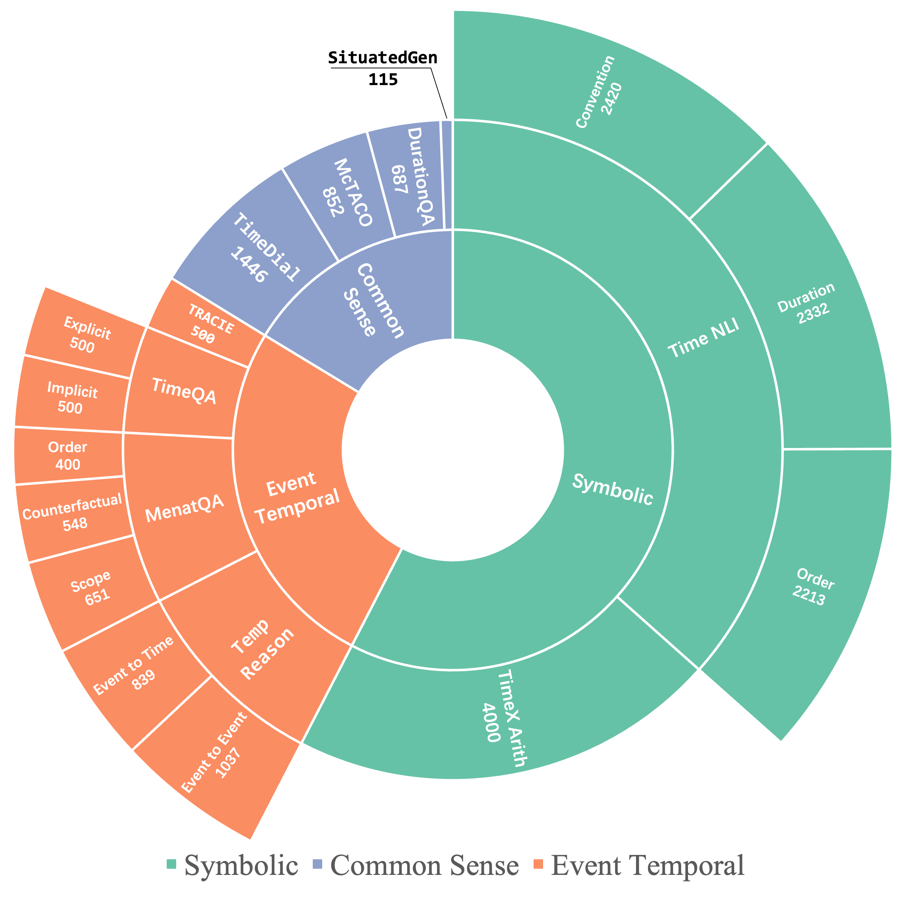

<div align="center">
<h1>
TimeBench: A Comprehensive Evaluation of
Temporal Reasoning Abilities in Large Language Models
</h1>
</div>

<div align="center">
    <a href="https://doi.org/10.48550/arXiv.2311.17667"></a>
    <!-- <a href="https://github.com/zchuz/TimeBench"></a> -->
    <a href="https://github.com/zchuz/TimeBench/blob/main/LICENSE">  </a>
</div>

This is the repository containing evaluation datas, instructions and demonstrations with ***ACL 2024*** paper _**TimeBench: A Comprehensive Evaluation of Temporal Reasoning Abilities in
  Large Language Models**_ ([Chu et al., 2023](https://arxiv.org/abs/2311.17667))

## Datasets



### Symbolic Temporal Reasoning
- TimeX-NLI ([Thukral et al., 2021](https://doi.org/10.18653/v1/2021.blackboxnlp-1.31))
- Date Arithmetic ([Tan et al., 2023](https://doi.org/10.18653/v1/2023.acl-long.828))
### Commonsense Temporal Reasoning
- MCTACO ([Zhou et al., 2019](https://doi.org/10.18653/v1/D19-1332))
- TimeDial ([Qin et al., 2021](https://doi.org/10.18653/v1/2021.acl-long.549))
- DurationQA ([Giovanni et al., 2022](https://aclanthology.org/2022.lrec-1.473))
- SituatedGen ([Zhang et al, 2023](https://doi.org/10.48550/arXiv.2306.12552))
### Event Temporal Reasoning
- TimeQA ([Chen et al., 2021](https://datasets-benchmarks-proceedings.neurips.cc/paper/2021/hash/1f0e3dad99908345f7439f8ffabdffc4-Abstract-round2.html))
- TempReason ([Tan et al., 2023](https://doi.org/10.18653/v1/2023.acl-long.828))
- MenatQA ([Wei et al., 2023](https://doi.org/10.48550/arXiv.2310.05157))
- TRACIE ([Zhou et al., 2021](https://doi.org/10.18653/v1/2021.naacl-main.107))
## Models
- GPT-4 ([OpenAI, 2023](https://doi.org/10.48550/arXiv.2303.08774))
- GPT-3.5 ([OpenAI, 2022](http://papers.nips.cc/paper\_files/paper/2022/hash/b1efde53be364a73914f58805a001731-Abstract-Conference.html))
- LLaMA2 ([Touvron et al., 2023](https://www.google.com.hk/url?sa=t&rct=j&q=&esrc=s&source=web&cd=&cad=rja&uact=8&ved=2ahUKEwiR3dXNzemCAxVmslYBHfz4AnkQFnoECAYQAQ&url=https%3A%2F%2Fai.meta.com%2Fllama%2F&usg=AOvVaw2NNlbTg8mieJEHSM4T8jGp&opi=89978449))
- Baichuan2 ([Yang et al., 2023](https://doi.org/10.48550/arXiv.2309.10305))
- Vicuna-1.5 ([Chiang et al., 2023](https://lmsys.org/blog/2023-03-30-vicuna/))
- Mistral ([Jiang et al., 2023](https://doi.org/10.48550/arXiv.2310.06825))
- ChatGLM3 ([Zeng et al., 2023](https://openreview.net/pdf?id=-Aw0rrrPUF))
- FLAN-T5 ([Chung et al., 2022](https://arxiv.org/abs/2210.11416))

## Performance


## Citation
If you find our work helpful, you can cite this paper as:

```bibtex
@misc{chu2023timebench,
      title={TimeBench: A Comprehensive Evaluation of Temporal Reasoning Abilities in Large Language Models}, 
      author={Zheng Chu and Jingchang Chen and Qianglong Chen and Weijiang Yu and Haotian Wang and Ming Liu and Bing Qin},
      year={2023},
      eprint={2311.17667},
      archivePrefix={arXiv},
      primaryClass={cs.CL},
      url={https://arxiv.org/abs/2311.17667}
}
```
